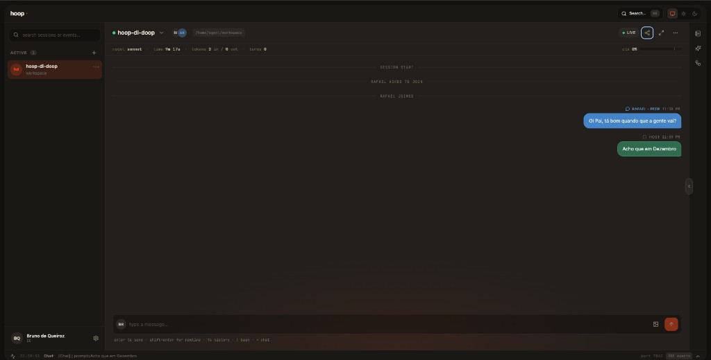
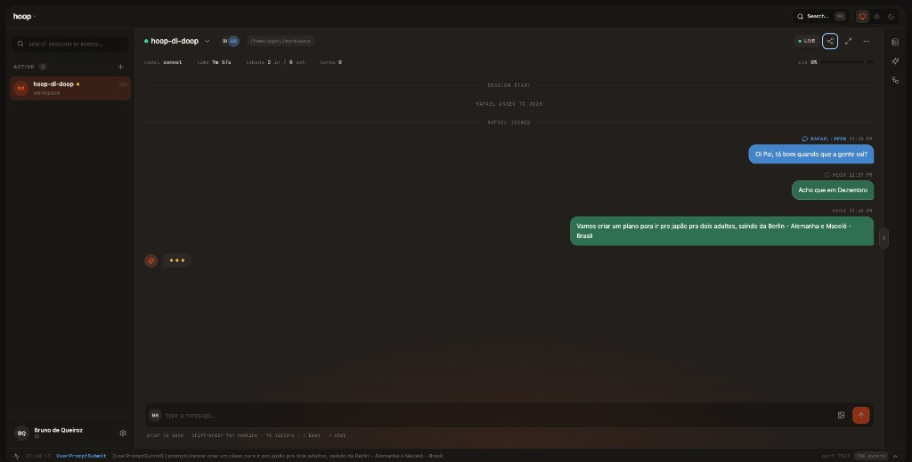
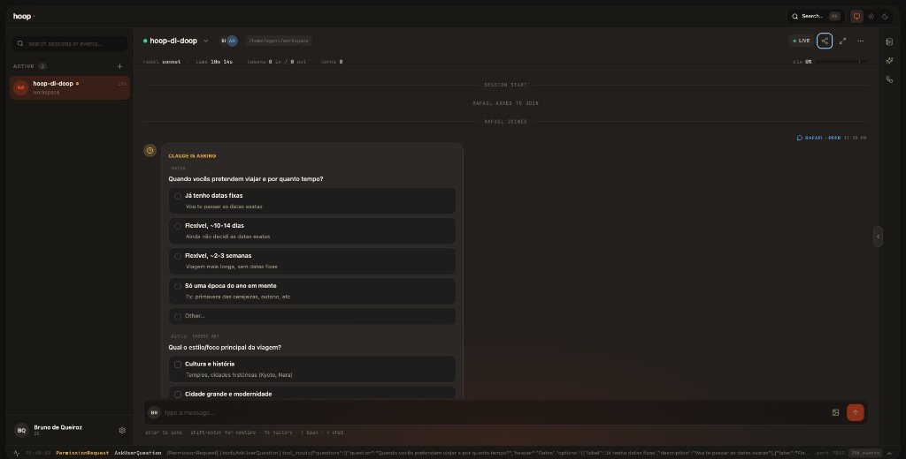
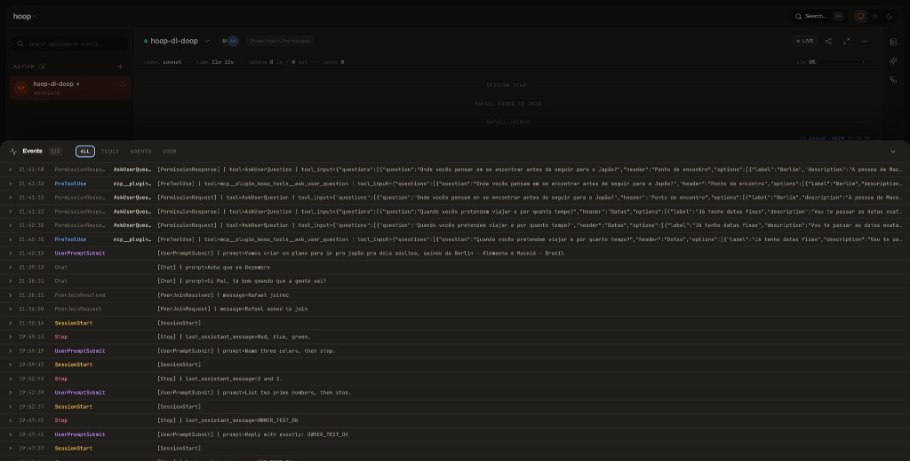
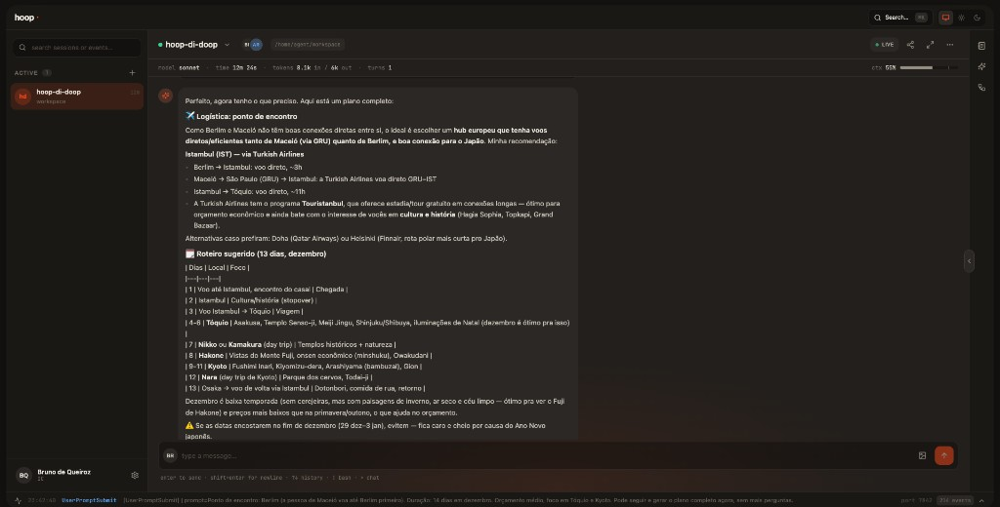
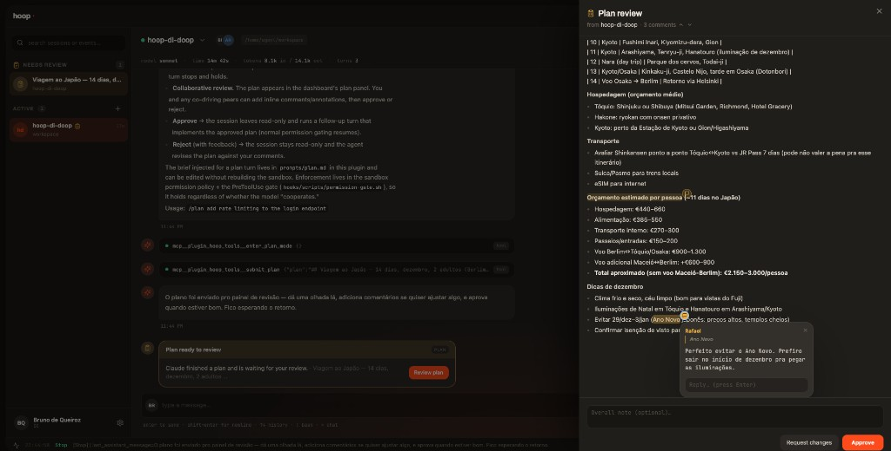
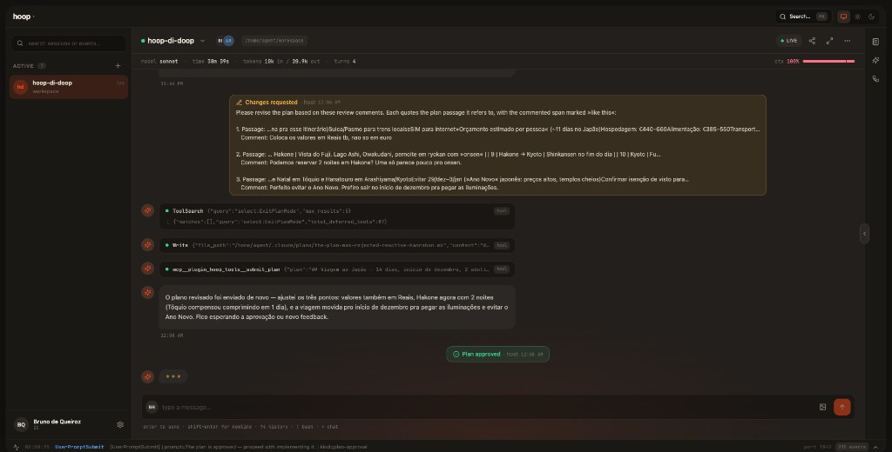
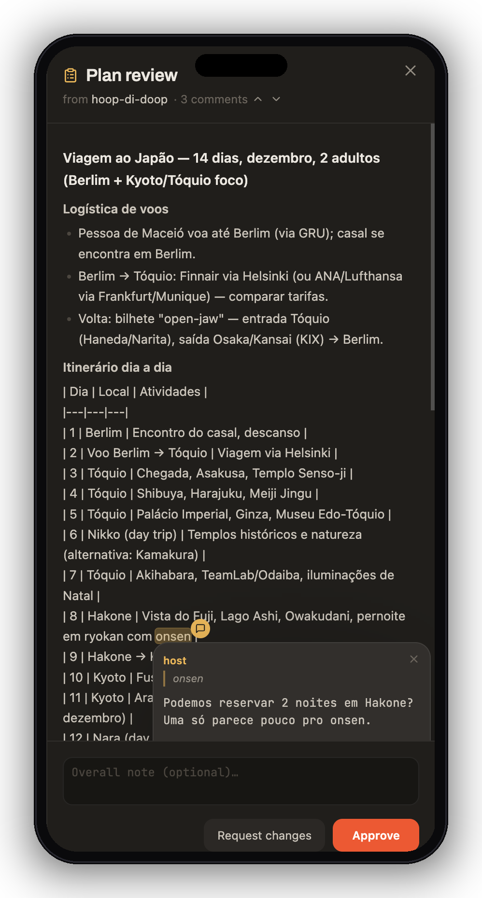

<p align="center">
  
</p>

# hoop

[](https://github.com/bruno-de-queiroz/hoop/actions/workflows/ci.yml)

Being alone is not a requirement. A sandboxed and web harness on top of Claude Code. Two deliverables in one install:

1. **`/hoop:setup`** — an interactive wizard that wires a curated stack (memory, code-graph RAG, automation, platform MCPs, docs RAG, observability, design, second-brain).
2. **`/hoop:dashboard`** — a containerized local web dashboard (Next.js, [http://localhost:7842/](http://localhost:7842/)) with live sessions, a skill browser with one-click triggers, a nested sub-agent tree, push-based event observability, and BM25 + optional semantic search across all events.

The plugin **does not re-implement** any of the third-party MCPs or skills it installs. It picks, installs, documents, and observes them.

## Install

```text
/plugin marketplace add bruno-de-queiroz/hoop
/plugin install hoop@hoop-marketplace
/plugin list
/reload-plugins
/hoop:setup
```

(The `/plugin list` + `/reload-plugins` dance is required on Claude Code v2.1.138 to activate a freshly pre-seeded plugin in the current session. New sessions don't need it.)

## What the wizard does

`/hoop:setup` walks you through 10 steps with one consent at the top, then auto-installs everything (every command printed before it runs):

| # | Step | Pick |
|---|---|---|
| 1 | Consent | Y / N |
| 2 | Detect prior state | (read-only) |
| 3 | Memory | claude-mem / Mem0 / mcp-memory-service / MemPalace / skip |
| 4 | Code-graph RAG (if you code) | Serena / claude-context / code-graph-mcp / Cognee / skip |
| 5 | Automation | n8n-mcp yes / no |
| 6 | Platform MCPs | multi-select: Atlassian, Google Workspace, GitHub, incident.io, Slack |
| 7 | Docs RAG | Context7 yes / no |
| 8 | Observability | Sentry / Datadog (multi-select) |
| 9 | Design | Excalidraw yes / no |
| 10 | Second-brain | Obsidian (3 flavors) / Notion (2) / Logseq / NotebookLM |

Each step writes a line to `~/.claude/hoop/install-log.md` so re-runs are idempotent and auditable. Secrets are masked as `***` in the log.

## Dashboard

`/hoop:dashboard` (or `start | stop | restart | rebuild | status | logs`) runs the dashboard **inside a container**. Your host only needs Docker Desktop — no Node, no `npm install`, no Next.js build pollution. Each verb takes an optional service target (`all` (default) · `sandbox` · `dashboard`); `start` builds lazily (only when an image is missing) while `rebuild` always rebuilds.

Pairing (inviting a teammate to co-drive a session) also needs **`cloudflared`** on the host — it exposes the local dashboard over a public tunnel. Install with `brew install cloudflared` (macOS) or from the [Cloudflare downloads page](https://developers.cloudflare.com/cloudflare-one/connections/connect-networks/downloads/). The dashboard runs fine without it; only share links require it.

Five panels:

- **Sessions** — fs.watch on `~/.claude/sessions/`; updates in real time.
- **Skills** — every skill on disk (user + plugin), filterable, with a one-click "Run" that spawns `claude -p '/<name>'` inside the dashboard container and streams stdout back to the panel.
- **Sub-agents** — nested tree reconstructed from PreToolUse / PostToolUse events on the `Agent` tool. Click a node to see its prompt, tool calls, and final output.
- **Events** — chronological live tail via Server-Sent Events. Hooks push each event to the sandbox's `/ingest` over the Unix domain socket; the dashboard tails the resulting stream with zero polling.
- **Search** — opens with ⌘K. BM25 (FTS5) always works; semantic search (sqlite-vec, 768-dim embeddings) activates when an embedding backend is configured — a local OpenAI-compatible embedder such as Ollama (`nomic-embed-text`, works on any Docker engine), Docker Model Runner (auto-detected on `:12434`; Docker Desktop 4.42+ or the `docker-model-plugin` on Docker CE), or OpenAI. Configure it via `/hoop:setup`; hybrid uses Reciprocal Rank Fusion.

The dashboard is single-user and localhost-only by design; access is gated by a per-install token (see [Architecture](#architecture) below).

## CLI (`hoop`)

`plugins/hoop/cli/` ships a small [oosh](https://github.com/bruno-de-queiroz/oosh)-based CLI that wraps the runtime. It lives **inside the plugin** (framework engine + entry point + completions + the stack engine in `lib/stack.sh`) so it ships with the plugin and the slash commands (`/hoop:setup`, `/hoop:dashboard`) can invoke it directly. It needs no external install and resolves its own paths.

```bash
./plugins/hoop/cli/hoop.sh install     # symlink `hoop` onto PATH + shell completion (bash/zsh)
# or run in place without installing:
./plugins/hoop/cli/hoop.sh <module> <command>
```

Two levels: **top-level verbs** act on the whole stack; **modules** scope a single service. All of them drive one engine (`cli/lib/stack.sh`) — the single source of truth for host-side preflight (Claude profile, credential reconcile, plugin wiring, auth tokens, embedding env) and compose orchestration. `start`/`rebuild` are deliberately split — `start` only builds an image when it's missing (fast otherwise), while `rebuild` always rebuilds so you pick up code changes.

| Command | What it does |
|---|---|
| `hoop start` · `stop` · `restart` · `rebuild` · `status` · `logs` | Whole stack (`agent-sandbox` + `dashboard`) via the engine (`up -d` / `down` / `build + up -d --force-recreate` for the project). `rebuild` takes `-n\|--no-cache`. |

| Module | Commands | What it does |
|---|---|---|
| `dashboard` | `start` · `stop` · `restart` · `rebuild` · `status` · `logs` | Controls **only the `dashboard` UI container** (`--no-deps`, leaves `agent-sandbox` alone). `rebuild` takes `-n\|--no-cache`. |
| `sandbox` | `start` · `stop` · `restart` · `rebuild` · `update` | Controls **only the `agent-sandbox` container**. Lifecycle verbs run the shared engine scoped to the sandbox (so credential reconcile + plugin wiring + forwarded env still happen); `rebuild` recreates the container (`-n\|--no-cache` to skip the layer cache); `update` pins the baked-in `claude-code` version (`-c\|--claude-version`). |
| `open` | *(default)* | Runs a **fresh, telemetry-isolated sandbox** over the current directory: mounts `$PWD` read-write into the agent workspace and launches `claude` interactively (`docker run --rm -it`, real tty for the TUI). Forces `HOOP_DISABLE_TELEMETRY=1` (add `-T\|--telemetry` to allow bundled-tool telemetry) and strips the dashboard-only hooks + the hoop plugin from an overlay `settings.json`, while keeping credentials, setup MCPs, skills, and other plugins. Extra args pass straight through, e.g. `hoop open --model opus` or `hoop open "fix the failing test"`. |
| `add` | `mcp` · `plugin` · `skill` | Installs a component into the **sandbox profile** so it persists across rebuild/restart/recreate **and** is shared by both dashboard sessions and `hoop open` (the profile is bind-mounted into both). `mcp <name> [flags] [-- <cmd>]` → `claude mcp add`, defaulting to `--scope user` so the server is global (not stranded under one project — pass your own `-s\|--scope` to override); `plugin [-m\|--marketplace <spec>] <plugin[@marketplace]>` → `claude plugin install`; `skill -d\|--dir <dir> [-f\|--force]` copies a local skill directory (must contain `SKILL.md`) into `~/.claude/skills/<name>`, **dereferencing symlinks** so the real files resolve inside the container. `mcp`/`plugin` need the sandbox running; `skill` is host-only. |
| `mount` | `add` · `list` · `remove` | Bind-mounts host folders into the sandbox workspace at `/home/agent/workspace/<name>`. `add -p\|--path <host-dir> [-n\|--name <name>]` adds one (the `-p` path tab-completes directories), `list` shows the configured mounts, `remove <name>` drops one. Mounts persist via a generated compose override; each `add`/`remove` **recreates the `agent-sandbox` container**. |

```bash
hoop start                    # bring up the whole stack at http://localhost:7842/
hoop dashboard rebuild        # rebuild + recreate ONLY the dashboard container
hoop sandbox rebuild          # rebuild + recreate ONLY the agent-sandbox container
hoop open                     # interactive claude in a sandbox over $PWD
hoop add mcp context7 -- npx -y @upstash/context7-mcp   # install an MCP (user scope) into the sandbox
hoop add skill -d ~/.claude/skills/impeccable           # copy a local skill into the sandbox profile
hoop mount add -p ~/code/myproject                      # expose a host folder to the sandbox workspace
```

The `add` / `mount` subcommands are also exposed as the **`/hoop:add`** and **`/hoop:mount`** slash commands, which delegate to this CLI. Everything `add` writes lives in `~/.claude/hoop/sandbox/profile` (bind-mounted at `/home/agent`), so a component installed once is available in every dashboard session and in `hoop open`, and survives image rebuilds.

`hoop open` uses the `hoop-sandbox` image (build it once with `hoop sandbox rebuild`) and mounts the sandbox Claude profile (`~/.claude/hoop/sandbox/profile`, `-p\|--profile` to override) so `claude` is already authenticated — run `hoop start` once to seed those credentials from your host. Unlike the dashboard's `agent-sandbox`, `open` runs with telemetry blackholed and without hoop's dashboard hooks/plugin (which need the dashboard's socket), so it's a clean, isolated interactive session that still has your setup MCPs and skills. `hoop install` / `hoop uninstall` manage the PATH symlink and shell wiring; the repo itself is never modified.

### Browser automation

The `hoop-sandbox` image ships a **headless Chromium + the official [`@playwright/mcp`](https://github.com/microsoft/playwright-mcp)**, registered in the sandbox profile automatically (from inside the container, via `claude mcp add`, so the registration can't point at a browser the running image doesn't have). The agent gets `browser_navigate`, `browser_click`, `browser_type`, `browser_fill_form`, `browser_snapshot`, `browser_take_screenshot`, and more — driven by a browser that runs **entirely in-container** as the unprivileged `agent` user. No host browser, no host process, no `host.docker.internal` gymnastics, and nothing runs in *your* user context. Because the same image + profile back both surfaces, browser tools are available in every dashboard session **and** in `hoop open`.

Two deliberate hardening choices:

- **Ephemeral profile (`--isolated`).** The browser profile is kept in memory and never written to disk, so no cookies or logins persist across sessions and there's no ambient auth lying around. To drive a site that needs a login, hand the browser tools a `--storage-state` file (see the [`@playwright/mcp` docs](https://github.com/microsoft/playwright-mcp#user-profile)).
- **No arbitrary-code tool.** `@playwright/mcp` exposes `browser_run_code_unsafe` (arbitrary JavaScript in the Playwright process, RCE-equivalent) as a non-removable "core" capability. hoop denies it via Claude's own `permissions.deny` in the sandbox `settings.json`, so the model never sees it — the rest of the toolset is unaffected.

## Pairing & plan review

`/hoop:dashboard` can hand a **share link** to a teammate over a `cloudflared` tunnel. They open it, pick a name, and the host admits them; from that point both sides see the same live transcript and can chat (`>` prefix) or co-drive the model — from a laptop or a phone.

Run a turn with `/plan <task>` and the sandbox forces the agent **read-only**: it investigates, then submits a plan that opens in a **review panel**. The host and any full-capability peer can drop **inline comments** anchored to the exact passage — synced live across everyone — then **Approve** or **Request changes**. A rejection feeds the comments back and the agent revises the plan.

### The host's flow, end to end

|  |  |
|:--|:--|
| <br><sub>**1 · Chat** — a peer joins and both sides chat in-thread (`>` prefix); no model turn is spent.</sub> | <br><sub>**2 · Prompt** — the host sends a normal turn to the model.</sub> |
| <br><sub>**3 · Clarify** — the agent asks structured questions before planning.</sub> | <br><sub>**4 · Observe** — every hook event streams into the live Events panel.</sub> |
| <br><sub>**5 · Plan** — `/plan` forces the agent read-only; it drafts a plan instead of acting.</sub> | <br><sub>**6 · Review** — the plan opens for inline comments, then Approve / Request changes.</sub> |

<p align="center">
  <br>
  <sub><b>7 · Iterate</b> — “Request changes” feeds the comments back; the agent revises read-only and resubmits, and once the host approves the session leaves plan mode and implements it.</sub>
</p>

Peers co-drive the same session from anywhere — here's “Rafael” reviewing the plan from his phone:

<p align="center">
  
</p>

## Architecture

The runtime is split across **two containers** so a compromise of the web layer can't reach your credentials:

- **`agent-sandbox`** (trusted) — owns the `claude` binary, your Claude profile (OAuth credentials, plugins, MCP config, sessions/transcripts), the long-lived `claude -p --input-format=stream-json` subprocesses, and `events.db` (sole writer). It exposes a small HTTP API over a **Unix domain socket** (`/var/run/hoop/sandbox.sock`) — no TCP port. The model runs as an unprivileged `agent` user, and the plugin source is mounted read-only where that user can't reach it or tamper with hook scripts.
- **`dashboard`** (untrusted view) — Next.js bound to `127.0.0.1:7842`, with **no `claude` binary and no access to `~/.claude`**. Every API route is a thin proxy that calls the sandbox over the socket, so a compromised dashboard can only do what the sandbox API allows.

`events.db` stays the source of truth: the sandbox writes it (hooks fire there), the dashboard only reads it via the socket. Three tokens gate the three hops:

| Token | Hop | Header |
|---|---|---|
| `dashboard.token` | browser ↔ dashboard | `x-dashboard-token` (+ cookie) |
| `sandbox.token` | dashboard ↔ sandbox | `x-sandbox-token` |
| `hook.token` | hook scripts ↔ sandbox `/ingest` | `x-hook-token` |

This is the "sandboxed agent" model: the OS-process boundary is the security boundary, and the dashboard holds no secrets. Pairing (co-driving a session with a teammate) layers on top via `cloudflared` and per-peer share tokens.

## State written by the plugin

```
~/.claude/hoop/
  install-log.md       append-only audit trail of every setup run
  events.jsonl         audit log of every event + fallback if the dashboard is down
  events.db            SQLite (FTS5 + sqlite-vec) consumed by the dashboard
  hoop.env             opt-in: OPENAI_API_KEY / EMBEDDING_BASE_URL overrides (sandbox-facing)
```

The plugin does **not** edit your `~/.claude/CLAUDE.md` or `~/.claude/settings.json`.

## Repo structure

```
hoop/
  .claude-plugin/marketplace.json        self-hosted marketplace
  plugins/hoop/
    .claude-plugin/plugin.json           manifest
    commands/                            /hoop:setup, /hoop:dashboard, /hoop:plan, /hoop:add, /hoop:mount
    catalog/                             8 install recipes (one per wizard layer)
    hooks/                               hooks.json + emit-event.sh (Unix-socket push, <50ms)
    sandbox/                             trusted agent runtime (owns claude + all state)
      Dockerfile                         sandbox image (claude + Node HTTP server on a UDS)
      server.ts                          HTTP-over-Unix-socket API the dashboard proxies to
      lib/                               active-sessions, db, ingestor, embeddings, sessions,
                                         skills, agents, search, spawn, shares, peer-joins, …
    dashboard/                           untrusted view (no claude, no credentials)
      Dockerfile                         dashboard image (Next.js standalone; no claude, no compilers)
      docker-compose.yml                 agent-sandbox + dashboard services (embeddings via external Ollama/DMR/OpenAI)
      app/api/*                          proxy routes → sandbox over the socket
      lib/sandbox-client/                HTTP-over-UDS client; lib/auth*, lib/peer-*  (auth + pairing)
    shared/                              logger, clamp, shutdown (used by both images)
    templates/install-log.md.tmpl
    cli/                                 oosh-based `hoop` CLI (ships inside the plugin)
      oo.sh                              oosh framework engine
      hoop.sh                            entry point (+ hoop.comp.sh / hoop.zcomp.sh)
      lib/stack.sh                       the two-service runtime engine (preflight + compose)
      modules/                           dashboard, sandbox, open, add, mount, install, uninstall
  README.md
  LICENSE
```

## Hooks pipeline

`hooks/hooks.json` registers PreToolUse, PostToolUse, SessionStart, Stop, and UserPromptSubmit. Every event runs `hooks/scripts/emit-event.sh` which:

1. POSTs the JSON event to the sandbox's `/ingest` endpoint over the Unix domain socket (`--unix-socket`) via `curl --max-time 1` — push, not polling. (`HOOP_INGEST_URL` can override the target for legacy/dev setups.)
2. Falls back to appending to `events.jsonl` if the socket isn't reachable.
3. Exits in <50ms — pure bash + curl, no node/python/jq.

The sandbox is the sole writer: its ingest route persists to SQLite + FTS5 (and sqlite-vec if semantic search is enabled), then emits on an in-process EventEmitter that feeds the SSE stream the dashboard proxies to the browser. On startup, the ingestor drains `events.jsonl` from its saved offset so events written while the dashboard was down replay automatically.

`hooks/scripts/permission-gate.sh` (PreToolUse) is the sole tool-permission gate: it asks the sandbox over the same socket and blocks until the host (or a peer allowed to decide) responds — this is what backs `/plan`'s read-only enforcement and the plan-review approval flow below.

## Roadmap

- **v0.1** (this release): wizard, containerized dashboard, push-based event pipeline, BM25 + opt-in semantic search.
- **v0.2**: inject skill triggers into existing Claude sessions instead of spawning new ones; per-skill-run isolation via ephemeral containers.
- **v0.3+**: more catalog entries; non-Claude clients (Cursor, Codex) where MCPs overlap.

## Contributing

This is opinionated by design. PRs welcome, especially:

- Verifying install commands on less-common platforms (Windows, NixOS).
- Adding new catalog options with verified install recipes.

Please open an issue before changing the curation philosophy (curated menus, one-consent install, no re-implementation, single-user localhost dashboard).

## License

MIT
